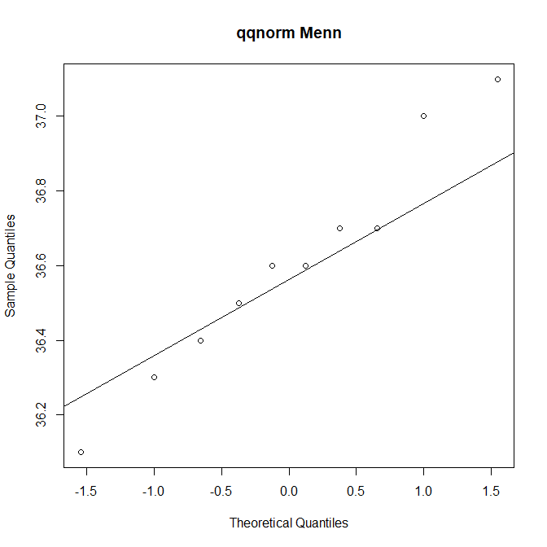

# STK1110 Oblig 2

## Oppg 1

Leser inn dataen:

```R
path="https://www.uio.no/studier/emner/matnat/math/STK1110/data/temp.txt"
data=read.table(path,header=T)
```

### a. Lag boksplot og normalfordelingsplott for observasjonene

Lager boksplot:

```R
boxplot(data, xlab="kjønn", ylab="C", main="Kroppstemperatur pr. kjønn")
```


Fra boksplottet ser det ut som menn har lavere gjennomsnitstemperatur. Men med større ekstremverdier. Kvinner ser ut til å være betydelig varmere, men ingen klar siginifikant forskjell. Dermed må vi ha en hypotesetest for å bestemme signifikansen.

For å gjøre hypotesetest med t-fordeling må vi annta at dataen er normalfordelt. Dette ser vi med qt qqnorm og qqline.

```R
qqnorm(data$Menn, main="qqnorm Menn")
qqline(data$Menn)
qqnorm(data$Kvinner, main="qqnorm Kvinner")
qqline(data$Kvinner)
```

Som gir:




qqnorm Menn ser ut til å ha noe større eksremverdier, enn en normalmodell ville forklart. Men siden det er såpass få verdier som er vell ekstreme, kan vi annta en normalfordeling.

qqnorm Kvinner ser ut til å følge normalfordelingen tettere. Med noe avvik i de høyeste verdiene. Men vi anntar her også at normalfordelingsmodellen holder.

### b. Utled en H-test med alfa 0.05. for at forventet kropstemperatur er den samme.
Hypotesetest:
H0: 

Data:

```R
alfa = 0.05
x = data$Menn
y = data$Kvinner
```

Mellomregninger:

```R
mean.x = mean(x)
mean.y = mean(y)
sd.x = sd(x)
sd.y = sd(y)
m = length(x)
n = length(y)
se.x = sd.x/sqrt(m)
se.y = sd.y/sqrt(n)
df = ( (se.x)^2 + (se.y)^2 )^2 / ( (((se.x)^4)/(m-1)) + ((se.y)^4/(n-1)) )
```
